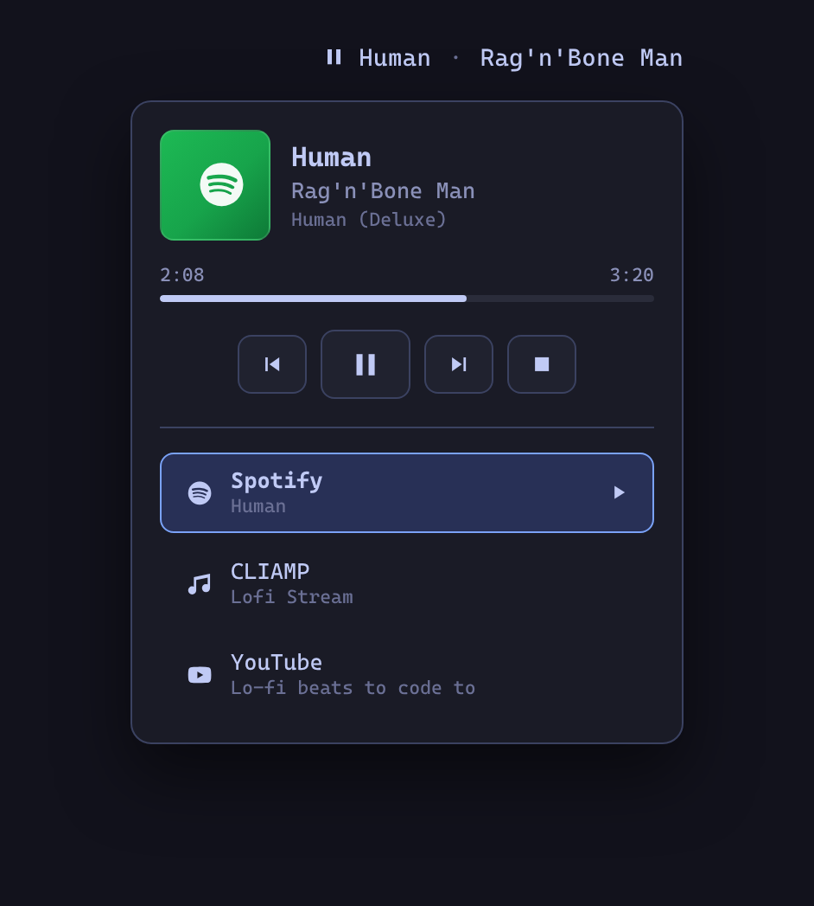
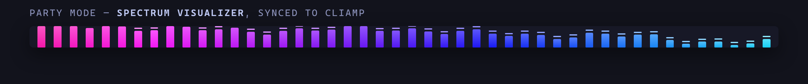

# CLIAMP for Omarchy

An [Omarchy](https://omarchy.org) bar widget for [CLIAMP](https://cliamp.stream), the retro
terminal music player. See what's playing at a glance and control playback without leaving
your workflow — works with the CLIAMP TUI and with `cliamp --daemon` alike. When Spotify or
YouTube playback is detected, the widget follows and controls those too.



## Features

- **Now playing in the bar** — play/pause state glyph plus a scrolling title · artist label.
- **One-click transport** — left click toggles play/pause, middle click skips ahead, and the
  scroll wheel moves through the playlist.
- **Detail popup** — right click opens track details with album art, previous / play-pause /
  next / stop buttons, a progress bar for regular tracks, a LIVE badge for radio streams, and
  the current playlist position.
- **Spotify and YouTube, when detected** — the Spotify desktop app and YouTube / YouTube Music
  (in a browser or as a PWA) are picked up over MPRIS. The widget auto-follows whichever
  source is playing, preferring cliamp, and the popup grows a picker to pin a source when more
  than one is around.
- **Party Mode** — turn the whole top bar into a beat-reactive synthwave light show, in your
  choice of a cliamp-style **spectrum visualizer** or a scrolling **gradient** wash. See below.
- **Scriptable** — the plugin's service exposes IPC methods, so keybindings get the same
  on-screen-display feedback as Omarchy's built-in media controls.

## Party Mode



Right-click the widget and hit **Party Mode** to wash the entire Quickshell top bar in a
beat-reactive synthwave light show. Two styles, switchable from the popup or settings:

- **Bars** — a cliamp-style spectrum analyser with falling peak caps, drawn straight from
  cliamp's live audio bands (`cliamp visstream`).
- **Gradient** — a scrolling neon wash with parallax layers and light-sweeps.

The colours are derived from your active **Omarchy theme accent** and re-derive automatically
when you switch themes. Playback drives the motion: cliamp gets the real spectrum, while
Spotify and YouTube — which expose no audio data over MPRIS — get a lively synthetic
visualizer that dances while they play and settles the moment they pause.

The overlay is purely decorative: it never intercepts clicks, scrolls, or keyboard input on
the bar beneath it. The popup's quick controls switch style and nudge the intensity; the
persistent defaults live in the widget settings.

## Requirements

- Omarchy with the plugin-capable shell (`omarchy plugin` available).
- [`cliamp`](https://github.com/bjarneo/cliamp) on your `PATH`. The widget talks to the running
  instance through cliamp's own remote-control CLI, so no MPRIS proxy is needed.
- Spotify and YouTube support needs nothing extra — those sources are detected through the
  MPRIS players the apps already register.

## Install

```bash
omarchy plugin add https://github.com/bscott/cliamp-oma-plugin.git --enable
```

Then place the **CLIAMP** widget in your bar from the Omarchy bar settings (category *Media*).

## Usage

| Input | Action |
|-------|--------|
| Left click | Play / pause |
| Middle click | Next track |
| Scroll wheel | Previous / next track |
| Right click | Open the detail popup |

The widget dims to a note glyph while no media source is reachable. Start `cliamp` (or
`cliamp --daemon` for headless playback), Spotify, or a YouTube tab and it lights back up
on the next poll. All controls target the active source, shown in the popup's picker.

### Settings

Configurable from the widget's bar settings:

| Setting | Default | Description |
|---------|---------|-------------|
| Refresh interval | 2 s | How often to poll `cliamp status --json`. |
| Max label width | 180 px | Label width before the title scrolls. |
| Hide when unavailable | off | Remove the widget entirely while cliamp isn't running. |
| Party Mode style: spectrum bars | on | On shows the spectrum analyser; off shows the gradient wash. |
| Party Mode intensity | 34 % | Strength of the effect painted over the bar (8–60%). |
| Party Mode reacts to the beat | on | Drive the effect from cliamp's real audio bands. |

### IPC / keybindings

The service registers the `cliamp` IPC target, so playback can be driven from scripts or
Hyprland keybindings with on-screen-display feedback:

```bash
omarchy-shell cliamp playPause
omarchy-shell cliamp next
omarchy-shell cliamp previous
omarchy-shell cliamp stop
omarchy-shell cliamp status   # JSON playback state, including active/detected sources
omarchy-shell cliamp source spotify   # pin a source: cliamp, spotify, or youtube
omarchy-shell cliamp party             # toggle Party Mode (also partyOn / partyOff)
omarchy-shell cliamp partyStyle bars   # set style: bars or gradient (partyStyleToggle to flip)
```

Example Hyprland binding (`~/.config/hypr/bindings.conf`):

```ini
bindd = SUPER SHIFT, P, Toggle CLIAMP playback, exec, omarchy-shell cliamp playPause
```

Plain `cliamp toggle` works too — the IPC route just adds the OSD popup.

## Development

Install the plugin with `omarchy plugin add` (above), then edit it in place under
`~/.config/omarchy/plugins/io.github.bscott.cliamp`. After changes:

```bash
omarchy plugin validate ~/.config/omarchy/plugins/io.github.bscott.cliamp
omarchy-restart-shell   # reload the shell so the service and overlay pick up edits
```

## License

[MIT](LICENSE)
